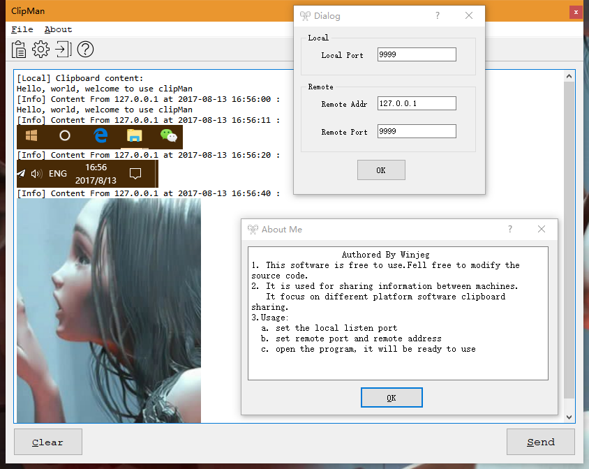

# clipman
### brief intro
Clipman is a program for sharing clipboard crossing computers. it supports linux, windows, macos, etc
I wrote this, because there is no such program that I count find to do the samething.

## usage
#### First: how to build
import the project by using qt to open the  "clipman.pro" file
build with qt should be easy for everyone

#### the conf file
there is an example conf file 
```
[local]
# local port that the program listens, buy default it listens on all adress for port specified
port=9999

[remote]
# addr is the remote machine ipv4 address that you have already installed clipman
addr=127.0.0.1
# port is the remote port that you will send clipboard conent to
port=9999

```

####  send tricks
you only need to make sure the sender remote infomation is correct if you want to make one way sending.
if you want to share it bio-directionaly you need to confirm is correct on both computers.

#### others
1. you should click send button or press [alter + enter] to send the content to remote computer
2. to exit the program double click on the tray icon
3. to show the logs click the tray incon


## clipman snapshot



# Have fun!
